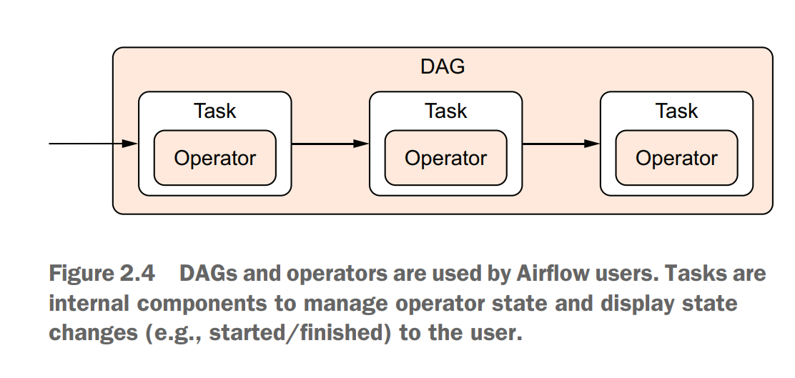
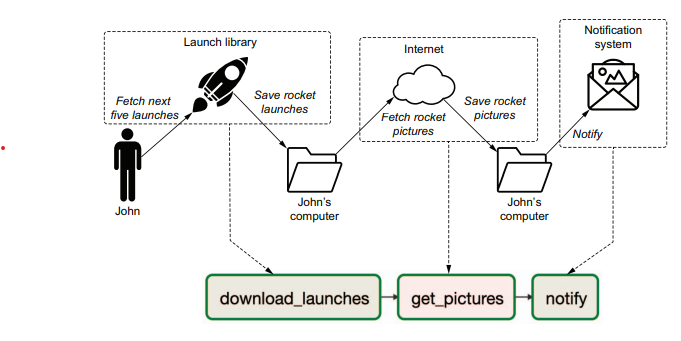

# AIRFLOW

## Anatomy of Airflow DAG

There is a difference, though. Tasks in Airflow manage the execution of an operator;
they can be thought of as a small wrapper or manager around an operator that
ensures the operator executes correctly. The user can focus on the work to be done
by using operators, while Airflow ensures correct execution of the work via tasks




**Run dag in python env: **

1 airflow db init
2 airflow users create --username admin --password admin --firstname Anonymous --lastname Admin --role Admin --email admin@example.org
3 cp download_rocket_launches.py ~/airflow/dags/
4 airflow webserver
5 airflow scheduler


**Run in Docker:**

docker run \
-ti \
-p 8080:8080 \
-v /path/to/dag/download_rocket_launches.py:/opt/airflow/dags/
download_rocket_launches.py \
--entrypoint=/bin/bash \
--name airflow \
apache/airflow:2.0.0-python3.8 \
-c '( \
airflow db init && \
airflow users create --username admin --password admin --firstname
Anonymous --lastname Admin --role Admin --email admin@example.org \
); \
airflow webserver & \
airflow scheduler


**Or from bash file**

Save the script
script in download_rocket.sh 

Make it executable
```bash
chmod +x download_rocket.sh
```

Execute the script by running:
```bash
./download_rocket.sh
```


http:/ /localhost:8080 and log in with username “admin” and password
“admin” to view Airflow.


 Workflows in Airflow are represented in DAGs.
 Operators represent a single unit of work.
 Airflow contains an array of operators both for generic and specific types of
work.
 The Airflow UI offers a graph view for viewing the DAG structure and tree view
for viewing DAG runs over time.
 Failed tasks can be restarted anywhere in the DAG.

## Scheduling in Airflow


## Dependencies between tasks


### Linear dependencies
 single linear chain of tasks
 ex:
 download_launches = BashOperator(...) >> get_pictures = PythonOperator(...) >> notify = BashOperator(...)

 

### Fan-in/-out dependencies

### Branching within tasks
